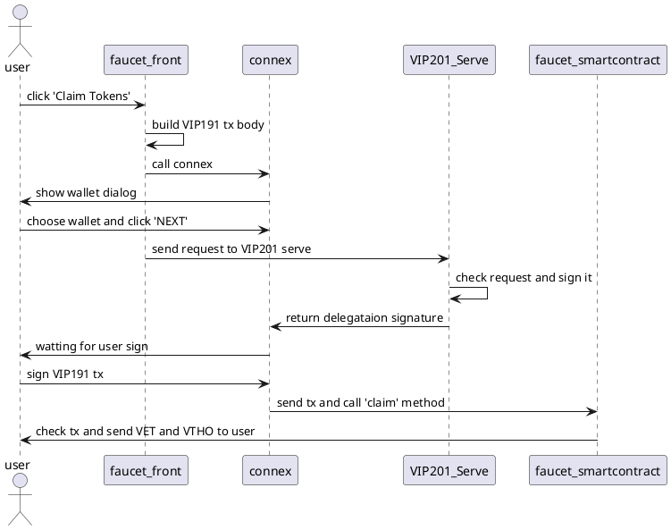

# faucet-new

[]()
[]()
[]()

## 1.Introduction

The project fork from [faucet-app](https://github.com/vechain/faucet-app).New faucet supported [VIP191](https://github.com/vechain/VIPs/blob/master/vips/VIP-191.md) and [VIP201](https://github.com/vechain/VIPs/blob/master/vips/VIP-201.md).

It a sample to show you how to use there VIPs to make easier for end users to use VeChainThor blockchain.

### About Connex
For now,faucet-new support [Connex 1.x](https://github.com/vechain/connex/tree/master/packages/connex), it just working on [Sync](https://env.vechain.org/#sync).

But if you want to test `Sync 2.0`, you can check [connex2.0 branch](https://github.com/mongelly/faucet-new/tree/connex2.0), it an `alpha` test version.

## 2. Working Sequence Diagram



## 3. Stormbreaker Feedelegation Serve([VIP201](https://github.com/vechain/VIPs/blob/master/vips/VIP-201.md))

More about VIP201 Serve implementation, you can ref [Stormbreaker Feedelegation Serve](https://github.com/mongelly/stormbreaker-feedelegation-serve)

## Project setup
```
npm install
```

### Compiles and hot-reloads for development
```
npm run serve
```

### Compiles and minifies for production
```
npm run build
```

### Lints and fixes files
```
npm run lint
```

### Customize configuration
See [Configuration Reference](https://cli.vuejs.org/config/).
